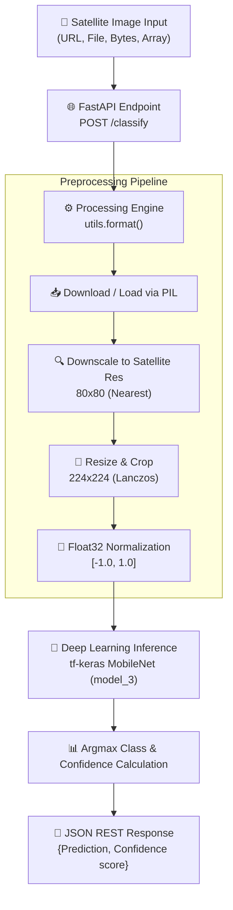

# 🛳️ Satellite Ship Detection API & Computer Vision Pipeline

[](https://www.python.org/)
[](https://fastapi.tiangolo.com/)
[](https://www.tensorflow.org/)
[](https://www.docker.com/)

An end-to-end Computer Vision REST API designed to detect ships from satellite imagery. Powered by a fine-tuned MobileNet architecture trained via Google Teachable Machine and deployed using **FastAPI**, **tf-keras**, **PIL**, and **Docker** for seamless cloud deployment (Hugging Face Spaces, AWS, Render, etc.).

[Visit Link](https://ship-satellite-api-cv.onrender.com/docs#/default/classify_classify_post) : it takes some time to load !

---

## 🎓 Model Training & Evolution

### 🤖 Google Teachable Machine Integration
The deep learning classification backends were trained using **Google Teachable Machine**, leveraging transfer learning over a pre-trained **MobileNet** feature extractor. Transfer learning allowed us to freeze low-level edge/texture layers and train custom classification heads (`Dense5` and `Dense6`) specifically tuned to high-frequency maritime and satellite spatial patterns.

### 🔬 Model Iterations Comparison

| Model Version | Architecture | Ship Accuracy | No-Ship Accuracy | Key Enhancements / Focus |
| :--- | :--- | :---: | :---: | :--- |
| **Model 1** | MobileNet v1 (Default Teachable Machine) | 100.0% | 98.0% | Initial baseline trained on raw satellite image tiles. High recall on ships but slight false-positives on coastal noise. |
| **Model 2** | MobileNet v1 (Augmented & Fine-tuned) | 98.0% | 99.0% | Added dataset augmentations (rotations, brightness contrast shifts) to reduce false positives on coastline/harbor textures. |
| **Model 3** *(Production)* | MobileNet v1 (Low-Resolution Optimized) | **98.0%** | **99.0%** | Fine-tuned specifically for downscaled $80 \times 80$ satellite tile resolutions with PIL Lanczos/Nearest spatial matching. Deployed in production API. |

---

## 🏗️ Architecture & Flow Scheme



---

## 📂 Directory Structure

```text
.
├── 📄 Dockerfile                 # Containerization setup for Hugging Face / Cloud
├── 📄 main.py                   # FastAPI REST API entry point
├── 📄 model.py                  # Local batch evaluation & testing script
├── 📄 requirements.txt           # Lightweight production dependencies
├── 📄 utils.py                  # PIL-based multi-input preprocessing pipeline
├── 📁 models/                    # Trained Deep Learning Model Versions
│   ├── 📁 model_1/              # Model iteration 1 (.h5, labels, metrics)
│   ├── 📁 model_2/              # Model iteration 2 (.h5, labels, metrics)
│   └── 📁 model_3/              # Production Model (.h5, labels, metrics)
│       ├── 📄 keras_model.h5    # Quantized MobileNet model weights
│       ├── 📄 labels.txt        # Class mappings (0-no_ship, 1-ship)
│       ├── 📄 model.md          # Performance report & metrics
│       └── 📁 img/              # Confusion matrix & accuracy curves
└── 📁 data/                      # Local Satellite Benchmark Dataset
    ├── 📁 ship/                 # Positive satellite samples (80x80)
    └── 📁 no_ship/              # Negative satellite samples (80x80)
```

---

## 📄 File Details

Below is the detailed breakdown of every component in the codebase:

* 🚀 [main.py](file:///Users/wess/Desktop/computer%20vision/Ship_Satellite_API_CV%F0%9F%9B%B3%EF%B8%8F/main.py): **FastAPI Web Server**. Exposes `/classify` to accept image URLs via Pydantic JSON payloads, triggers preprocessing, runs deep learning inference using `model_3`, and returns JSON responses.
* 🛠️ [utils.py](file:///Users/wess/Desktop/computer%20vision/Ship_Satellite_API_CV%F0%9F%9B%B3%EF%B8%8F/utils.py): **Core Preprocessing Pipeline**. Implements flexible multi-source input parsing (URLs, local paths, bytes, PIL Images, OpenCV arrays), simulates satellite downscaling to 80x80, fits to 224x224, and normalizes arrays to $[-1.0, 1.0]$.
* 🧪 [model.py](file:///Users/wess/Desktop/computer%20vision/Ship_Satellite_API_CV%F0%9F%9B%B3%EF%B8%8F/model.py): **Local Batch Evaluator**. Evaluates model accuracy and error counts directly against local dataset subfolders (`data/ship`, `data/no_ship`).
* 🧠 [models/model_3/keras_model.h5](file:///Users/wess/Desktop/computer%20vision/Ship_Satellite_API_CV%F0%9F%9B%B3%EF%B8%8F/models/model_3/keras_model.h5): **Production Model Weights**. MobileNet feature extractor fine-tuned for high accuracy on satellite tile images.
* 🏷️ [models/model_3/labels.txt](file:///Users/wess/Desktop/computer%20vision/Ship_Satellite_API_CV%F0%9F%9B%B3%EF%B8%8F/models/model_3/labels.txt): Class index mappings (`0 0-no_ship`, `1 1-ship`).
* 📊 [models/model_3/model.md](file:///Users/wess/Desktop/computer%20vision/Ship_Satellite_API_CV%F0%9F%9B%B3%EF%B8%8F/models/model_3/model.md): Detailed model evaluation summary (99% no-ship accuracy, 98% ship accuracy).
* 🐳 [Dockerfile](file:///Users/wess/Desktop/computer%20vision/Ship_Satellite_API_CV%F0%9F%9B%B3%EF%B8%8F/Dockerfile): Minimal Docker container config targeting port 7860 (Hugging Face Spaces standard).
* 📦 [requirements.txt](file:///Users/wess/Desktop/computer%20vision/Ship_Satellite_API_CV%F0%9F%9B%B3%EF%B8%8F/requirements.txt): Production dependency manifest (`fastapi`, `uvicorn`, `tensorflow`, `tf-keras`, `pillow`, `requests`, `numpy`).

---

## 🧮 How It Works (Core Logic)

### 1. Multi-Format Flexible Parsing
The preprocessing engine in [utils.py](file:///Users/wess/Desktop/computer%20vision/Ship_Satellite_API_CV%F0%9F%9B%B3%EF%B8%8F/utils.py#L8-L44) normalizes input sources into a standard RGB PIL Image:
$$\text{Input Source} \longrightarrow \text{PIL.Image (RGB)}$$

### 2. Satellite Downscaling & Resampling
High-resolution input images are first downscaled to 80x80 satellite tile resolution using **Nearest Neighbor** filtering to match the sensor characteristics of the training dataset:
$$\text{Image}_{\text{tiny}} = \text{Resize}_{\text{NEAREST}}(\text{Image}_{\text{RGB}}, (80, 80))$$

Next, `ImageOps.fit` resizes and crops the tile into $(224 \times 224)$ dimensions using **Lanczos** interpolation:
$$\text{Image}_{224} = \text{Fit}_{\text{LANCZOS}}(\text{Image}_{\text{tiny}}, (224, 224))$$

### 3. Normalization & Batch Reshaping
Pixel values in $[0, 255]$ are scaled to the range $[-1.0, 1.0]$ expected by MobileNet:
$$X_{\text{norm}} = \left( \frac{X_{\text{float32}}}{127.5} \right) - 1.0$$
A batch dimension is appended to yield shape $(1, 224, 224, 3)$.

---

## 🛠️ Setup & Requirements

### 1. Prerequisites
- Python 3.12
- `virtualenv` or `venv`

### 2. Installation
Clone the repository and create a virtual environment:

```bash
# Clone the repository
git clone https://github.com/Wissem-Sahli-Engineer/Ship_Satellite_API_CV.git
cd Ship_Satellite_API_CV

# Create and activate a virtual environment
python3.12 -m venv .venv
source .venv/bin/activate

# Install dependencies
pip install -r requirements.txt
```

### 3. Running Locally
Start the FastAPI server with live-reloading:

```bash
uvicorn main:app --reload
```
The server will start at `http://127.0.0.1:8000`.

### 4. Running via Docker

```bash
# Build Docker image
docker build -t ship-satellite-api .

# Run Docker container
docker run -p 7860:7860 ship-satellite-api
```

---

## 🎮 Controls / Usage

### REST API Endpoints

#### 1. Health Check
* **GET** `/`
```bash
curl -X GET "http://127.0.0.1:8000/"
```
* **Response:**
```json
{
  "message": "Ship Detection API is up and running!"
}
```

#### 2. Classify Satellite Image
* **POST** `/classify`
* **Headers:** `Content-Type: application/json`
* **Payload:**
```json
{
  "image_url": "https://example.com/path/to/satellite_ship_image.png"
}
```

* **Example `curl` Request:**
```bash
curl -X POST "http://127.0.0.1:8000/classify" \
     -H "Content-Type: application/json" \
     -d '{"image_url": "https://raw.githubusercontent.com/Wissem-Sahli-Engineer/Ship_Satellite_API_CV/main/data/ship/1__20180711_180503_1027__-118.22759694858797_33.721431071380884.png"}'
```

* **Sample Response:**
```json
{
  "Prediction ": "1-ship",
  "Confidence score ": 0.9844
}
```

#### Interactive API Documentation
Once the server is running, explore the interactive Swagger UI documentation at:
👉 **`http://127.0.0.1:8000/docs`**
