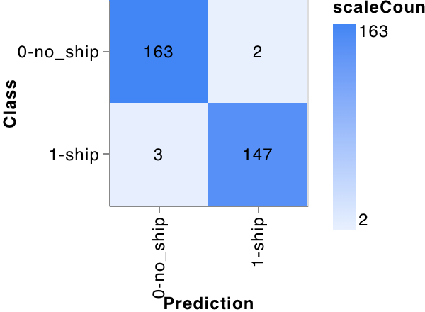
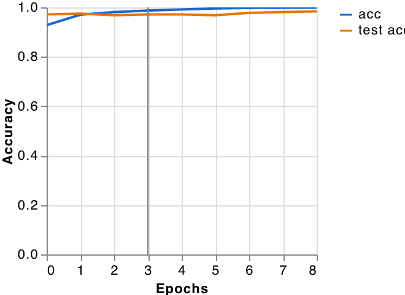
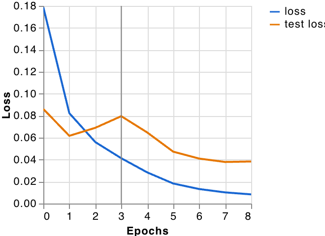

# Model Evaluation & Metrics

## 1. Accuracy Per Class
| Class | Accuracy | # Samples |
| :--- | :---: | :---: |
| **0-no_ship** | 0.99 (99%) | 165 |
| **1-ship** | 0.98 (98%) | 150 |

---

## 2. Confusion Matrix

---

## 3. Accuracy Per Epoch

---

## 4. Loss Per Epoch

